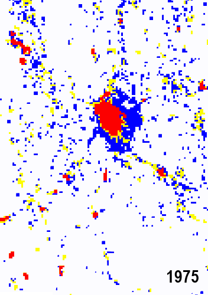
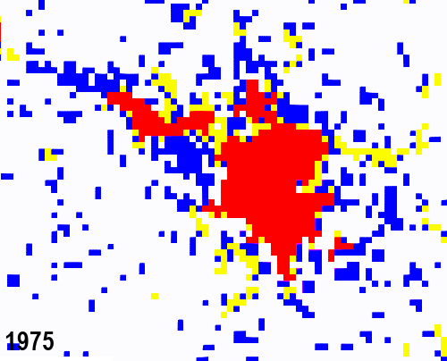
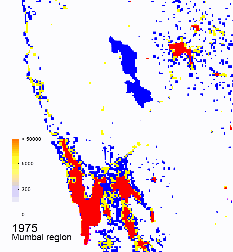
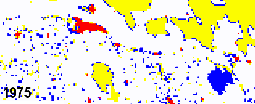

# Satellite-Image-Analysis
This repository contains some preliminary data, utility scripts, and experiments. This repositorry is a part of the larger research project by the satellite image research group at AlgoAsylum., and is still in progress! We will update this repository frequently with new experiments and publications of open-source code and results. You can reach out to any of the contributors of this repository for more details.

### Tracking Urbanization 
Bangalore  
  
Hyderabad  
  
Mumbai  
  
Patna  
  

### NightLight Images Statewise for India
#### Data
DMSP - https://drive.google.com/drive/folders/1XUdo3IQIX_ENn92dS9PIpB7Ns-gM9EP0?usp=sharing

VIIRS - https://drive.google.com/drive/folders/10ZlYujELTgkDhflTp_-OLqLTwS1blDPQ?usp=sharing
